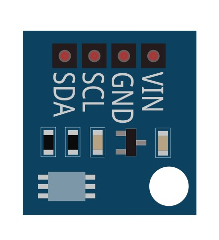
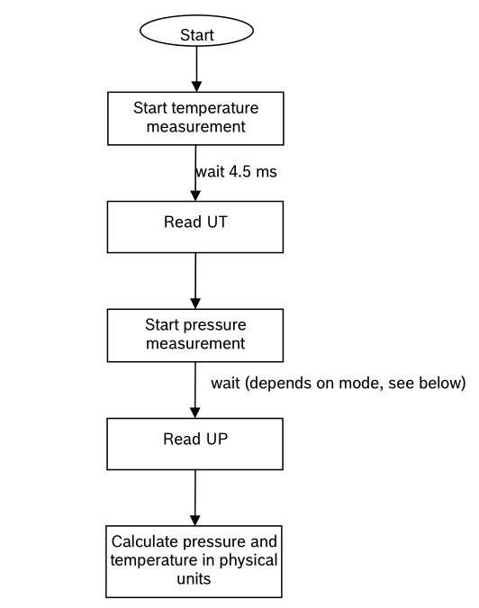
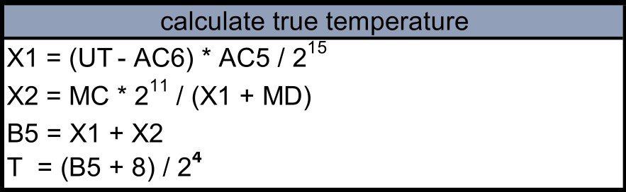
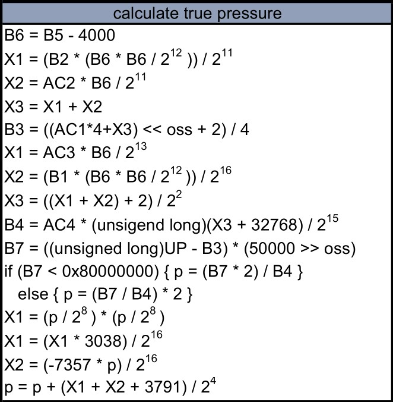
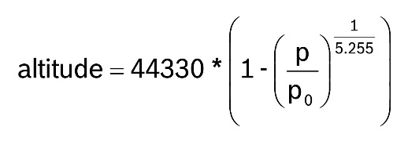
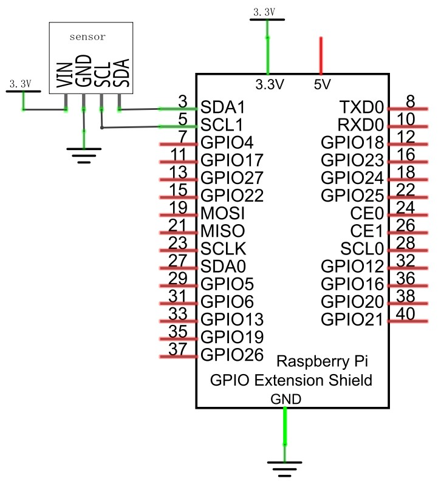
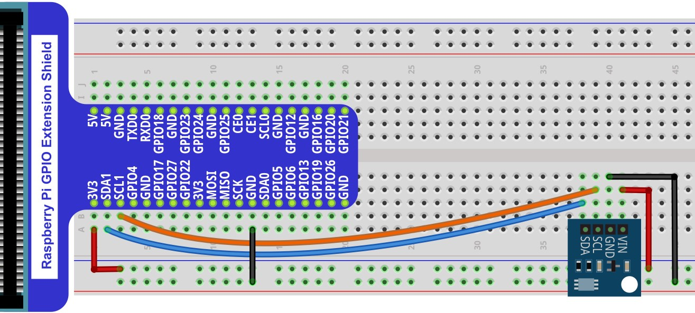

##############################################################################
Chapter BMP180 Barometric Pressure Sensor
##############################################################################

In this chapter, we will learn how to use BMP180 barometric pressure sensor.

Project 33.1 Barometer
****************************************************************

Component List
================================================================

+--------------------------------------------------+-------------------------------------------------+
|1. Raspberry Pi (with 40 GPIO) x1                 |                                                 |
|                                                  | Jumper Wires x4                                 |
|2. GPIO Extension Board & Ribbon Cable x1         |                                                 |
|                                                  |  |jumper-wire|                                  |
|3. Breadboard x1                                  |                                                 |
+--------------------------------------------------+-------------------------------------------------+
|BMP180 barometric pressure sensor x1                                                                |
|                                                                                                    |
|  |BMP180|                                                                                          |
+----------------------------------------------------------------------------------------------------+

.. |jumper-wire| image:: ../_static/imgs/jumper-wire.png

Component knowledge
================================================================

BMP180 barometric pressure sensor
----------------------------------------------------------------

The BMP180 barometric pressure sensor module is a high-precision barometric pressure sensor, which can detect temperature and barometric pressure, and through these two data, the current altitude can be calculated. Its pressure measurement range is from 300 to 1100 hPa (altitude 9000m to -500m), and temperature from -40°C to 85°C with an accuracy of ±1.0°C. Using the BMP180 module to get altitude and barometric pressure requires math.

The BMP180 is designed to connect directly to the microcontroller via the IIC bus. The pressure and temperature data must be compensated by the BMP180's E2PROM calibration data. The BMP180 consists of a piezoresistive sensor, an analog-to-digital converter and a control unit with E2PROM and serial IIC interface. The BMP180 provides uncompensated pressure and temperature values. The E2PROM stores 176 bits of individual calibration data, which is used to compensate sensor for offset, temperature dependence and other parameters.

The general process of BMP180 reading data and the calculation of each data are as follows:

Among them, UT is temperature data (16 bits), and UP is pressure data (16 to 19 bits).

Calculate temperature:

Calculate pressure:

Calculate absolute altitude. According to the measured air pressure p and sea level air pressure po (for example, 1013.25hPa), the altitude in meters can be calculated via the following international pressure formula:

Below is the pinout of BMP180 barometric pressure sensor.

**Pin description:**

.. list-table::
   :align: center
   :header-rows: 1
   :class: product-table

   * - symbol
     - Function

   * - VIN
     - Power supply pin, +1.6V~3.6V 

   * - GND
     - GND

   * - SCL
     - Serial clock pin of I2C interface

   * - SDA
     - Serial data pin of I2C interface

Please do not use voltage beyond the power supply range to avoid damage to the BMP180 barometric pressure sensor.

+------------------------------------------------------------------------------------------------+
|   Schematic diagram                                                                            |
|                                                                                                |
|   |BMP180_Sc|                                                                                  |
+------------------------------------------------------------------------------------------------+
|   Hardware connection. If you need any support,please feel free to contact us via:             |
|                                                                                                |
|   support@freenove.com                                                                         | 
|                                                                                                |
|   |BMP180_Fr|                                                                                  |
+------------------------------------------------------------------------------------------------+

Code
================================================================

C Code 33.1.1 Barometer
----------------------------------------------------------------

If you did not **configure I2C and Install Smbus**, please refer to :ref:`Chapter 7<ADC>`. If you did, please move on.

First observe the project result, and then learn about the code in detail.

.. hint:: 
    :red:`If you have any concerns, please contact us via:` support@freenove.com

1.  Use cd command to enter 33.1.1_Barometer directory of C code.

.. code-block:: console    
    
    $ cd ~/Freenove_Kit/Code/C_Code/33.1.1_Barometer

2.  Use following command to compile "Barometer.c" and generate executable file "Barometer ".

.. code-block:: console    
    
    $ gcc -o Barometer ./smbus.c ./Barometer.c -lm

3.  Run the generated file "Barometer "

.. code-block:: console    
    
    $ sudo ./Barometer

After the program is executed, the terminal will display the current air pressure value, temperature value and altitude.

The following is the program code:

.. literalinclude:: ../../../freenove_Kit/Code/C_Code/33.1.1_Barometer/Barometer.c
    :linenos: 
    :language: C

The function bmp180_GetTemperature() is used to calculate the current temperature value.

.. literalinclude:: ../../../freenove_Kit/Code/C_Code/33.1.1_Barometer/Barometer.c
    :linenos: 
    :language: C
    :lines: 150-157

The function bmp180_GetPressure() is used to calculate the current pressure value.

.. literalinclude:: ../../../freenove_Kit/Code/C_Code/33.1.1_Barometer/Barometer.c
    :linenos: 
    :language: C
    :lines: 123-147

The function bmp180_Altitude() is used to calculate the current altitude.   

.. literalinclude:: ../../../freenove_Kit/Code/C_Code/33.1.1_Barometer/Barometer.c
    :linenos: 
    :language: C
    :lines: 161-168

