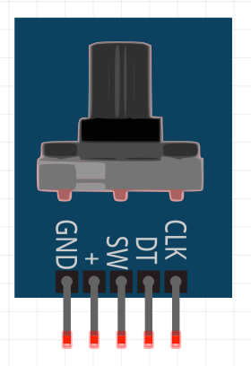
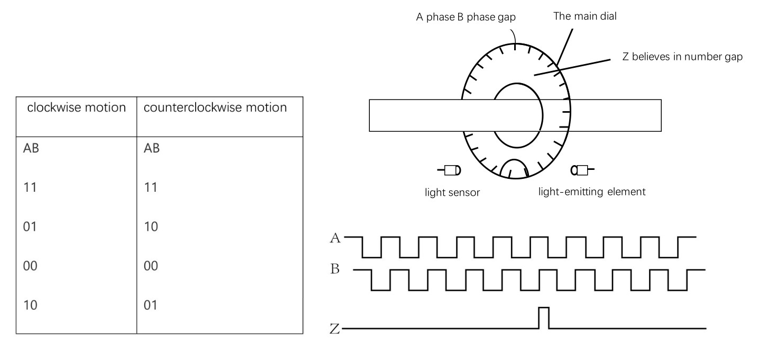
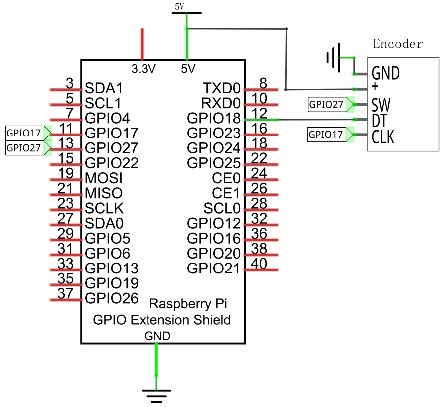
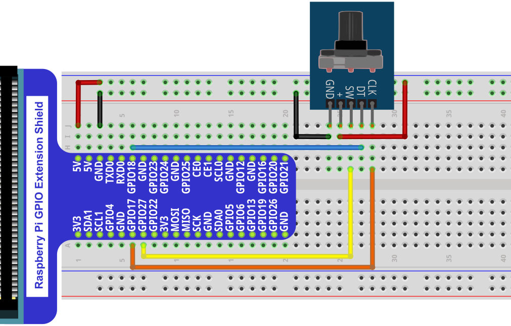
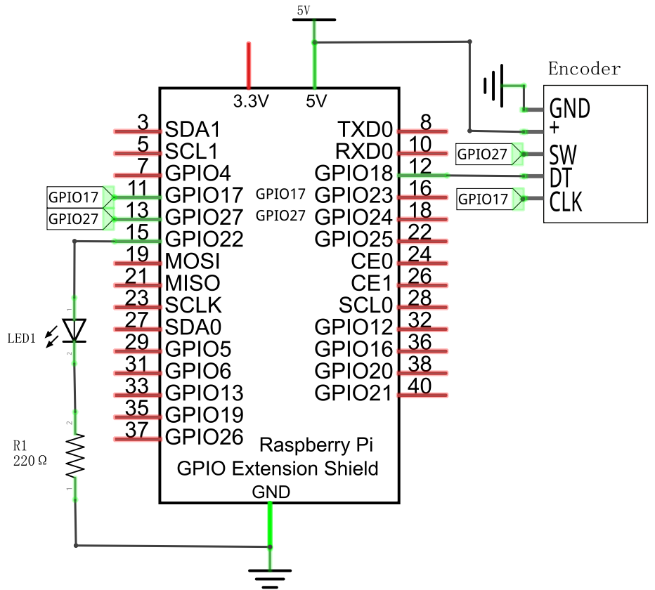

##############################################################################
Chapter Rotary Encoder
##############################################################################

In this chapter, we will learn how to use rotary encoder.

Project Rotary Encoder
****************************************************************

This project uses a rotary encoder to make a simple counter.

Component List
================================================================

+--------------------------------------------------+-------------------------------------------------+
|1. Raspberry Pi (with 40 GPIO) x1                 |                                                 |
|                                                  | Jumper Wires x7                                 |
|2. GPIO Extension Board & Ribbon Cable x1         |                                                 |
|                                                  |  |jumper-wire|                                  |
|3. Breadboard x1                                  |                                                 |
+--------------------------------------------------+-------------------------------------------------+
|Rotary encoder x1                                                                                   |
|                                                                                                    |
|  |Rotary_encoder1|                                                                                 |
+----------------------------------------------------------------------------------------------------+

.. |jumper-wire| image:: ../_static/imgs/jumper-wire.png

Component knowledge
================================================================

Rotary Encoder
----------------------------------------------------------------

A rotary encoder is a rotary sensor that converts the rotational displacement into a periodic electrical signal, and then converts the electrical signal into a count pulse, and uses the number of pulses to indicate the magnitude of the rotational displacement. It drives the internal grating disc to rotate through the rotation of the knob. Many slits are preset on the grating disc. The rotation of the grating disc causes the light passing through the slits to produce pulse changes. After the signal is processed by the subsequent circuit, it is output as a pulse signal. Finally, The rotary displacement of the knob can be obtained through the output of the signal pin. The encoder generates pulse signals through the configuration of the internal light source and photosensitive element. 

The working principle of the encoder and the schematic diagram of the output waveform are as follows:

A rotary encoder gives two-phase square waves, which are 90° out of phase, commonly referred to as A channel and B channel. One of the channels gives the information related to the rotation speed. The information of the rotation direction is obtained by sequentially comparing the signals of the two channels. There is also a special signal called Z or zero channel, which gives the absolute zero position of the encoder. This signal is a square wave that coincides with the center line of the A channel square wave.

The following is the internal cross-sectional structure diagram of the encoder:

.. image:: ../_static/imgs/Rotary_encoder_Knowledge_1.png
    :align: center

The number of pulses per revolution of the rotary encoder in this project is 20. Its working voltage is 5V. The sensor has 5 pins: SW, CLK, DT, power supply positive pin and power supply negative pin. Among them, the SW pin is the input signal pin, the rotary encoder sensor itself is also a button, when the button is pressed, the SW pin will jump from high level to low level. The CLK pin is a rotation signal pin. When not rotating, this pin outputs a high level, and when rotating, it outputs a low level. The DT pin is used to determine the direction of rotation. If this pin is high when it is not rotating, and becomes low when it is rotating, it means that clockwise rotation has occurred. When this pin is high when it is rotating, it means that counterclockwise rotation has occurred. When the positive and negative pins of the module are connected to a suitable power supply, the module starts to work. At this time, three pins on the development board need to be used to read the SW, CLK and DT of the module respectively. Then according to the above principle, the state of the rotary encoder can be determine. 

For example, when you turn the encoder clockwise by hand, the CLK outputs low level, and the DT changes from high level to low level. When you rotate the encoder counterclockwise by hand, the CLK outputs low level, and the DT changes from low level to high level. When you press the rotary encoder by hand, the SW signal outputs low level.

Circuit
================================================================

+------------------------------------------------------------------------------------------------+
|   Schematic diagram                                                                            |
|                                                                                                |
|   |Rotary_encoder_Sc|                                                                          |
+------------------------------------------------------------------------------------------------+
|   Hardware connection. If you need any support,please feel free to contact us via:             |
|                                                                                                |
|   support@freenove.com                                                                         | 
|                                                                                                |
|   |Rotary_encoder_Fr|                                                                          |
+------------------------------------------------------------------------------------------------+

Code
================================================================

C Code 31.1.1 RotaryEncoder
----------------------------------------------------------------

First observe the project result, and then learn about the code in detail.

.. hint:: 
    :red:`If you have any concerns, please contact us via:` support@freenove.com

1.  Use ``cd`` command to enter 31.1.1_RotaryEncoder directory of C code.

.. code-block:: console    
    
    $ cd ~/Freenove_Kit/Code/C_Code/31.1.1_RotaryEncoder

2.  Use following command to compile ``RotaryEncoder.c`` and generate executable file ``RotaryEncoder``.

.. code-block:: console    
    
    $ gcc RotaryEncoder.c -o RotaryEncoder -lwiringPi

3.  Run the generated file ``RotaryEncoder``.

.. code-block:: console    
    
    $ sudo ./RotaryEncoder

After the program is executed, the rotary encoder can count the number of output pulses during the forward and reverse rotation. When the rotary encoder is rotated clockwise by hand, the count value will increase. When the rotary encoder is rotated counterclockwise by hand , the count value will decrease. When the rotary encoder is pressed by hand, it can be reset to the initial state, that is, the count starts from 0.

The following is the program code:

.. literalinclude:: ../../../freenove_Kit/Code/C_Code/31.1.1_RotaryEncoder/RotaryEncoder.c
    :linenos: 
    :language: C

Function rotaryDeal() is used to determine whether the rotary encoder is rotating, and when there is rotation, determine whether it is rotating clockwise or counterclockwise. Use variable previousCounterValue to record the number of rotations. When rotating clockwise, the variable increases, and when rotating counterclockwise, the variable decreases.

.. literalinclude:: ../../../freenove_Kit/Code/C_Code/31.1.1_RotaryEncoder/RotaryEncoder.c
    :linenos: 
    :language: C
    :lines: 19-38

Read the SW signal pin of the rotary encoder, and determine whether the rotary encoder is pressed. If it is pressed, the variable previousCounterValue is cleared.

.. literalinclude:: ../../../freenove_Kit/Code/C_Code/31.1.1_RotaryEncoder/RotaryEncoder.c
    :linenos: 
    :language: C
    :lines: 51-56

Project Rotary Encoder
****************************************************************

This project uses a rotary encoder to adjust the LEDs to emit different brightness.

Component List
================================================================

+--------------------------------------------------+-------------------------------------------------+
|1. Raspberry Pi (with 40 GPIO) x1                 |                                                 |
|                                                  | Jumper Wires x8                                 |
|2. GPIO Extension Board & Ribbon Cable x1         |                                                 |
|                                                  |  |jumper-wire|                                  |
|3. Breadboard x1                                  |                                                 |
+-----------------------------+--------------------+------------------+------------------------------+
|Rotary encoder x1            |  LED x1                               |  Resistor 220Ω x1            |
|                             |                                       |                              |
|  |Rotary_encoder|           |   |red-led|                           |   |res-220R|                 |
+-----------------------------+---------------------------------------+------------------------------+

.. |jumper-wire| image:: ../_static/imgs/jumper-wire.png

.. |red-led| image:: ../_static/imgs/red-led.png
    :width: 50%
.. |res-220R| image:: ../_static/imgs/res-220R.png
    :width: 15%

Circuit
================================================================

+------------------------------------------------------------------------------------------------+
|   Schematic diagram                                                                            |
|                                                                                                |
|   |Rotary_encoder_Sc_1|                                                                        |
+------------------------------------------------------------------------------------------------+
|   Hardware connection. If you need any support,please feel free to contact us via:             |
|                                                                                                |
|   support@freenove.com                                                                         | 
|                                                                                                |
|   |Rotary_encoder_Fr_1|                                                                        |
+------------------------------------------------------------------------------------------------+

.. |Rotary_encoder_Fr_1| image:: ../_static/imgs/Rotary_encoder_Fr_1.png

Code
================================================================

C Code 31.2.1 Dimmable
----------------------------------------------------------------

First observe the project result, and then learn about the code in detail.

.. hint:: 
    :red:`If you have any concerns, please contact us via:` support@freenove.com

1.  Use ``cd`` command to enter 30.2.1_Dimmable directory of C code.

.. code-block:: console    
    
    $ cd ~/Freenove_Kit/Code/C_Code/31.2.1_Dimmable

2.  Use following command to compile ``Dimmable.c`` and generate executable file ``Dimmable``.

.. code-block:: console    
    
    $ gcc Dimmable.c -o Dimmable -lwiringPi

3.  Run the generated file ``Dimmable``

.. code-block:: console    
    
    $ sudo ./Dimmable

.. literalinclude:: ../../../freenove_Kit/Code/C_Code/31.2.1_Dimmable/Dimmable.c
    :linenos: 
    :language: C

Function rotaryDeal() is used to determine whether the rotary encoder is rotating, and when there is rotation, determine whether it is rotating clockwise or counterclockwise. Use variable previousCounterValue to record the number of rotations. When rotating clockwise, the variable increases, and when rotating counterclockwise, the variable decreases.

.. literalinclude:: ../../../freenove_Kit/Code/C_Code/31.2.1_Dimmable/Dimmable.c
    :linenos: 
    :language: C
    :lines: 22-41

Read the SW signal pin of the rotary encoder, and determine whether the rotary encoder is pressed. If it is pressed, the variable previousCounterValue is cleared.

.. literalinclude:: ../../../freenove_Kit/Code/C_Code/31.2.1_Dimmable/Dimmable.c
    :linenos: 
    :language: C
    :lines: 54-59

The variable previousCounterValue is limited here, and the PWM duty cycle of ledPin is set to previousCounterValue. The duty cycle of PWM should be less than or equal to 100.

.. code-block:: c

    if(previousCounterValue>=100){
            previousCounterValue=100;
    }
    if(previousCounterValue<=0){
        previousCounterValue=0; 
    }
    softPwmWrite(ledPin,previousCounterValue);    //Mapping to PWM duty cycle