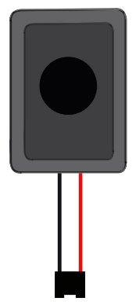
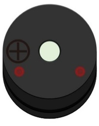
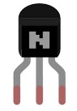
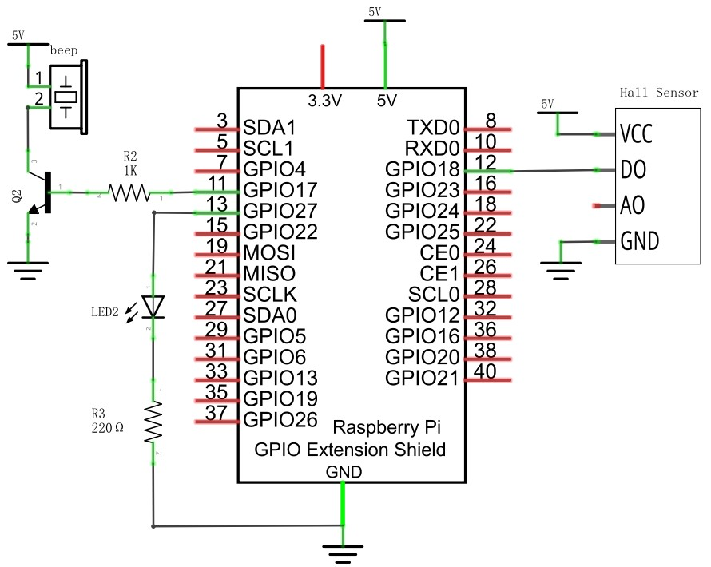
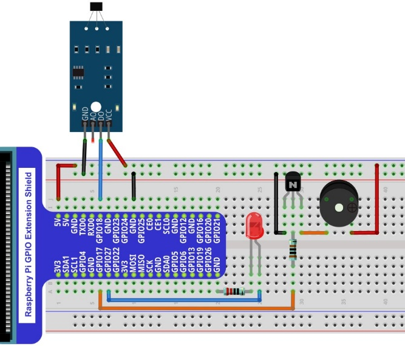
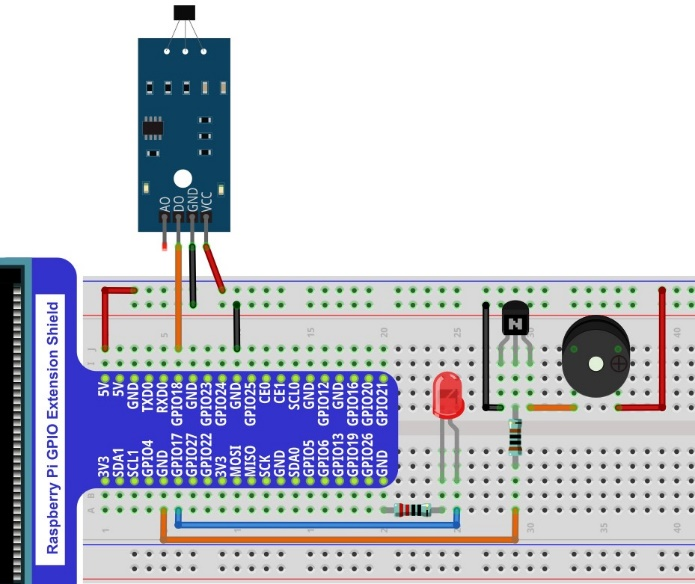

################################################################
Chapter High-sensitivity microphone sensor
################################################################

Project Hall Sensor and Buzzer
****************************************************************

This project uses Hall sensor to make a simple magnetic field detection sound and light alarm.

Component List
================================================================

+--------------------------------------------------+-------------------------------------------------+
|1. Raspberry Pi (with 40 GPIO) x1                 |                                                 |     
|                                                  | Jumper Wires x6                                 |       
|2. GPIO Extension Board & Ribbon Cable x1         |                                                 |       
|                                                  |  |jumper-wire|                                  |                                                            
|3. Breadboard x1                                  |                                                 |                                                                 
+--------------------------------------------------+-------------+-----------------------------------+
| Hall sensor x1                                   | LED x1      | NPN-transistor                    |
|                                                  |             |                                   |
|  |Hall_Sensor| :xx-large:`or` |Hall_Sensor_1|    |  |red-led|  |  |NPN-transistor|                 |                           
+-----------------------+--------------------------+-------------+----------+------------------------+
| Speaker x1            | Active buzzer x1         | Resistor 220Ω x1       | Resistor 1kΩ x1        |
|                       |                          |                        |                        |
|  |Speaker|            |  |Active-buzzer|         |  |res-220R|            |  |Resistor-1kΩ|        |                           
+-----------------------+--------------------------+------------------------+------------------------+

.. |jumper-wire| image:: ../_static/imgs/jumper-wire.png
.. |Hall_Sensor| image:: ../_static/imgs/Hall_Sensor.png
    :width: 30%
.. |Hall_Sensor_1| image:: ../_static/imgs/Hall_Sensor_1.png
    :width: 40%
.. |red-led| image:: ../_static/imgs/red-led.png
    :width: 50%
.. |res-220R| image:: ../_static/imgs/res-220R.png
    :width: 25%

.. |Resistor-1kΩ| image:: ../_static/imgs/Resistor-1kΩ.png
    :width: 28%

:red:`For the above two hall sensors, their difference is only the pin sequence is different, please get the Hall sensor, check its sequence, change the corresponding wiring, so as not to cause permanent damage to your raspberry PI.`

Circuit
================================================================

+------------------------------------------------------------------------------------------------+
|   Schematic diagram                                                                            |
|                                                                                                |
|   |Hall_Sensor_Sc_1|                                                                           |
+------------------------------------------------------------------------------------------------+
|   Hardware connection. If you need any support,please feel free to contact us via:             |
|                                                                                                |
|   support@freenove.com                                                                         | 
|                                                                                                |
|   |Hall_Sensor_Fr_2| :xx-large:`or` |Hall_Sensor_Fr_3|                                         |
+------------------------------------------------------------------------------------------------+

.. note::
    
    :red:`Please check the sequence of your Hall sensor and select the appropriate wiring to avoid permanent damage to your raspberry PI. `

Code
================================================================

Python Code 26.1.1 VoiceLamp
----------------------------------------------------------------

First observe the project result, and then learn about the code in detail.

.. hint:: 
    :red:`If you have any concerns, please contact us via:`  support@freenove.com

1.  Use ``cd`` command to enter 26.1 1_VoiceLamp directory of Python code.

.. code-block:: console

    $ cd ~/Freenove_Kit/Code/Python_GPIOZero_Code/26.1.1_VoiceLamp

2.  Use python command to execute code ``VoiceLamp.py``

.. code-block:: console

    $ python VoiceLamp.py

After the program is executed, when you speak to the sensor, the LED will turn on for 5 seconds. After 5 seconds, the LED will turn off. When the sensor does not recognize the sound, the LED will turn off.

The following is the program code:

.. literalinclude:: ../../../freenove_Kit/Code/Python_GPIOZero_Code/26.1.1_VoiceLamp/VoiceLamp.py
    :linenos: 
    :language: python

Import the MicrophoneSensor class from the sensor module. MicrophoneSensor is similar to the MotionSensor class in the GPIO Zero library in that they both actually use the SmoothedInputDevice class.

.. code-block:: python

    from sensor import MicrophoneSensor

Read the signal pin of the high-sensitivity microphone sensor to determine whether the state of the sensor is high. When the sensor recognizes the sound, it outputs a high level, the variable sensor.is_active is True, and the LED will turn on for 5 seconds and then turn off.

.. literalinclude:: ../../../freenove_Kit/Code/Python_GPIOZero_Code/26.1.1_VoiceLamp/VoiceLamp.py
    :linenos: 
    :language: python
    :lines: 17-26

sensor.py

Import the SmoothedInputDevice class from the GPIO Zero library, create the MicrophoneSensor class, and initialize the parameters.

.. literalinclude:: ../../../freenove_Kit/Code/Python_GPIOZero_Code/26.1.1_VoiceLamp/sensor.py
    :linenos: 
    :language: python

.. seealso::

    For more information about the methods used by the SmoothedInputDevice class in the GPIO Zero library,please refer to:https://gpiozero.readthedocs.io/en/stable/api_input.html#smoothedinputdevice
