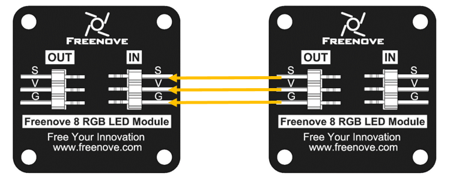
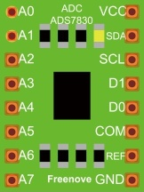
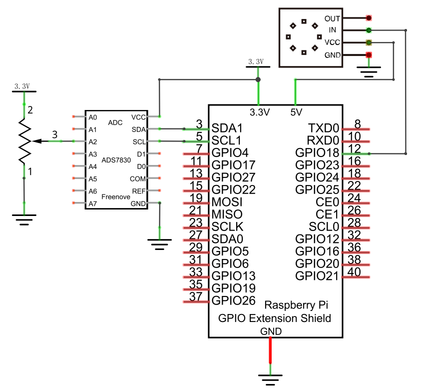

################################################################
Chapter LEDpixel
################################################################

In this chapter, we will learn Freenove 8 RGB LED Module.

 .. note::

    **If your Raspberry PI System is Bookworm, skip 32.1 and 32.2 and look at 32.3 instead. Because 32.1 and 32.2 use the rpi_ws2812 library, they are not compatible with Raspberry Pi5.**

Project LEDpixel
****************************************************************

This project will achieve an Freenove 8 RGB LED Module flowing water.

Component List
================================================================

+------------------------------------------+-----------------+
|1. Raspberry Pi (with 40 GPIO) x1         |                 |
|                                          | Jumper Wires x4 |
|2. GPIO Extension Board & Ribbon Cable x1 |                 |
|                                          |  |jumper-wire|  |
|3. Breadboard x1                          |                 |
+------------------------------------------+-----------------+
|Freenove 8 RGB LED Module x1                                |
|                                                            |
|  |LEDpixel|                                                |
+------------------------------------------------------------+

.. |jumper-wire| image:: ../_static/imgs/jumper-wire.png
.. |LEDpixel| image:: ../_static/imgs/LEDpixel.png
    :width: 30%

Component knowledge
================================================================

Freenove 8 RGB LED Module
----------------------------------------------------------------

The Freenove 8 RGB LED Module is as below. You can use only one data pin to control the eight LEDs on the module. As shown below:

.. image:: ../_static/imgs/LEDpixel_1.png
    :align: center

And you can also control many modules at the same time. Just connect OUT pin of one module to IN pin of another module. In such way, you can use one data pin to control 8, 16, 32 … LEDs.

+---------------------------------------+----------------------------------------+
|                  (IN)                 |                 (OUT)                  |
+========+==============================+========+===============================+
| symbol | Function                     | symbol | Function                      |
+--------+------------------------------+--------+-------------------------------+
| S      | Input control signal         | S      | Output control signal         |
+--------+------------------------------+--------+-------------------------------+
| V      | Power supply pin, +3.5V~5.5V | V      | Power supply pin, +3.5V~5.5V  |
+--------+------------------------------+--------+-------------------------------+
| G      | GND                          | G      | GND                           |
+--------+------------------------------+--------+-------------------------------+

Circuit
================================================================

+------------------------------------------------------------------------------------------------+
|   Schematic diagram                                                                            |
|                                                                                                |
|   |LEDpixel_Sc|                                                                                |
+------------------------------------------------------------------------------------------------+
|   Hardware connection. If you need any support,please feel free to contact us via:             |
|                                                                                                |
|   support@freenove.com                                                                         | 
|                                                                                                |
|   |LEDpixel_Fr|                                                                                |
+------------------------------------------------------------------------------------------------+

.. |LEDpixel_Sc| image:: ../_static/imgs/LEDpixel_Sc.png

.. _additional supplements:

Additional supplement 
================================================================

Raspbery Pi, other than 4B and 400, nees to disable the audio module, othewise the LED will not work properly.

1.	Create a new snd-blacklist.conf and open it for editing

.. code-block:: console    
    
    $ sudo nano /etc/modprobe.d/snd-blacklist.conf

Add following content: After adding the contents, you need to press Ctrl+O, Enter, Ctrl+Z.

.. code-block:: console    
    
    $ blacklist snd_bcm2835

.. image:: ../_static/imgs/black_list.png
    :align: center

2.	We also need to edit config file.

.. code-block:: console    
    
    $ sudo nano /boot/firmware/config.txt

Find the contents of the following two lines (with Ctrl + W you can search):

.. code-block:: console    
    
    $ # Enable audio (loads snd_bcm2835)
    $ dtparam=audio=on

Add # to comment out the second line. Press Ctrl+O, Enter, Ctrl+X.

.. code-block:: console    
    
    $ # Enable audio (loads snd_bcm2835)
    $ # dtparam=audio=on

.. image:: ../_static/imgs/audio.png
    :align: center

It will take effect after restarting, restart your RPi.

If you want to restart the audio module, just restore the content modified in the above two steps.

Code
================================================================

Python Code Ledpixel
----------------------------------------------------------------

Before running python code, please install WS281X library first.

1.	Enter the following command to install.

.. code-block:: console

    $ cd ~/Freenove_Kit/Libs/Python-Libs/rpi-ws281x-python/library && sudo python3 setup.py install

The installation is completed as shown in the figure below.

First observe the project result, and then learn about the code in detail.

.. hint:: 
    
    :red:`If you have any concerns, please contact us via:`  support@freenove.com

1.	Use ``cd`` command to enter 32.1.1_Ledpixel directory of Python code.

.. code-block:: console

    $ cd ~/Freenove_Kit/Code/Python_GPIOZero_Code/32.1.1_Ledpixel

2.	Use python command to execute code ``Ledpixel.py``.

.. code-block:: console

    $ sudo python Ledpixel.py

After the program runs, the LEDpixel will emit red, green and blue colors in turn like flowing water. If your Freenove 8 RGB LED Module doesn't work, you can try :ref:`additional supplements` to solve.

The following is the program code:

.. literalinclude:: ../../../freenove_Kit/Code/Python_GPIOZero_Code/32.1.1_Ledpixel/Ledpixel.py
    :linenos: 
    :language: python

Import rpi_ws281x modile. Set the number, pins and brightness of the LED.

.. literalinclude:: ../../../freenove_Kit/Code/Python_GPIOZero_Code/32.1.1_Ledpixel/Ledpixel.py
    :linenos: 
    :language: python
    :lines: 10-18

Define LED class.

.. literalinclude:: ../../../freenove_Kit/Code/Python_GPIOZero_Code/32.1.1_Ledpixel/Ledpixel.py
    :linenos: 
    :language: python
    :lines: 20-29

Light up the eight LEDs in red, green and blue in turn.

.. literalinclude:: ../../../freenove_Kit/Code/Python_GPIOZero_Code/32.1.1_Ledpixel/Ledpixel.py
    :linenos: 
    :language: python
    :lines: 34-45

Project RainbowLight
****************************************************************

In this project, we will learn to control the LED module with a potentiometer.

Component List
================================================================

+--------------------------------------------------+-------------------------------------------------+
|1. Raspberry Pi (with 40 GPIO) x1                 |                                                 |
|                                                  | Jumper Wires x13                                |
|2. GPIO Extension Board & Ribbon Cable x1         |                                                 |
|                                                  |  |jumper-wire|                                  |
|3. Breadboard x1                                  |                                                 |
+--------------------------------+-----------------+-------------------+-----------------------------+
|Freenove 8 RGB LED Module x1    |  Rotary Potentiometer x1            |  ADC Module x1              |
|                                |                                     |                             |
|  |LEDpixel|                    |   |Rotary-potentiometer|            |  |ADC-module-2|             |
+--------------------------------+-------------------------------------+-----------------------------+

.. |Rotary-potentiometer| image:: ../_static/imgs/Rotary-potentiometer.png
    :width: 60%

Circuit
================================================================

+------------------------------------------------------------------------------------------------+
|   Schematic diagram                                                                            |
|                                                                                                |
|   |LEDpixel_Sc_1|                                                                              |
+------------------------------------------------------------------------------------------------+
|   Hardware connection. If you need any support,please feel free to contact us via:             |
|                                                                                                |
|   support@freenove.com                                                                         | 
|                                                                                                |
|   |LEDpixel_Fr_1|                                                                              |
+------------------------------------------------------------------------------------------------+

.. |LEDpixel_Fr_1| image:: ../_static/imgs/LEDpixel_Fr_1.png

Code
================================================================

In this project, we will make a Servo rotate from 0 degrees to 180 degrees and then reverse the direction to make it rotate from 180 degrees to 0 degrees and repeat these actions in an endless loop.

Python Code RainbowLight
----------------------------------------------------------------

If you did not configure I2C, please refer to :doc:`Chapter 7 <ADC>`. If you did, please continue.

For Python code, ADCDevice requires a custom module which needs to be installed. If you have installed it in Chapter 7.Please skip the installation.

1.  Use ``cd`` command to enter folder of ADCDevice.

.. code-block:: console

    $ cd ~/Freenove_Kit/Libs/Python-Libs/

2.  Open the unzipped folder.

.. code-block:: console

    $ cd ADCDevice-1.0.4

3.  Install library for python2 and python3.

.. code-block:: console

    $ sudo python2 setup.py install 
    $ sudo python3 setup.py install 

First observe the project result, and then learn about the code in detail.

.. hint:: 
    
    :red:`If you have any concerns, please contact us via:`  support@freenove.com

4.  Use ``cd`` command to enter 32.2.1_Rainbow Light directory of Python code.

.. code-block:: console

    $ cd ~/Freenove_Kit/Code/Python_GPIOZero_Code/32.2.1_RainbowLight

5.  Use python command to execute code ``RainbowLight.py``.

.. code-block:: console

    $ sudo python RainbowLight.py

After running the program, you can change the color of the LED module by rotating the potentiometer.

The following is the program code:

.. literalinclude:: ../../../freenove_Kit/Code/Python_GPIOZero_Code/32.2.1_RainbowLight/RainbowLight.py
    :linenos: 
    :language: python
    :dedent:

This function converts HSL colors to RGB colors.

.. literalinclude:: ../../../freenove_Kit/Code/Python_GPIOZero_Code/32.2.1_RainbowLight/RainbowLight.py
    :linenos: 
    :language: python
    :lines: 41-57
    :dedent:

Read the ADC value of channel 2 in an infinite loop. Let the color of the eight LEDs change according to the value of the ADC.

.. literalinclude:: ../../../freenove_Kit/Code/Python_GPIOZero_Code/32.2.1_RainbowLight/RainbowLight.py
    :linenos: 
    :language: python
    :lines: 63-71
    :dedent:

Project SpiLEDpixel
****************************************************************

This project will control ledpixel to display any color by the Raspberry Pi's SPI.

Component List
================================================================

+--------------------------------------------------+-------------------------------------------------+
|1. Raspberry Pi (with 40 GPIO) x1                 |                                                 |
|                                                  | Jumper Wires x4                                 |
|2. GPIO Extension Board & Ribbon Cable x1         |                                                 |
|                                                  |  |jumper-wire|                                  |
|3. Breadboard x1                                  |                                                 |
+--------------------------------------------------+-------------------------------------------------+
|Freenove 8 RGB LED Module x1                                                                        |
|                                                                                                    |
|  |LEDpixel|                                                                                        |
+----------------------------------------------------------------------------------------------------+

Component knowledge
================================================================

Freenove 8 RGB LED Module
----------------------------------------------------------------

The Freenove 8 RGB LED Module is as below. You can use only one data pin to control the eight LEDs on the module. As shown below:

.. image:: ../_static/imgs/LEDpixel_1.png
    :align: center

And you can also control many modules at the same time. Just connect OUT pin of one module to IN pin of another module. In such way, you can use one data pin to control 8, 16, 32 … LEDs.

+---------------------------------------+----------------------------------------+
|                  (IN)                 |                 (OUT)                  |
+========+==============================+========+===============================+
| symbol | Function                     | symbol | Function                      |
+--------+------------------------------+--------+-------------------------------+
| S      | Input control signal         | S      | Output control signal         |
+--------+------------------------------+--------+-------------------------------+
| V      | Power supply pin, +3.5V~5.5V | V      | Power supply pin, +3.5V~5.5V  |
+--------+------------------------------+--------+-------------------------------+
| G      | GND                          | G      | GND                           |
+--------+------------------------------+--------+-------------------------------+

Circuit
================================================================

+------------------------------------------------------------------------------------------------+
|   Schematic diagram                                                                            |
|                                                                                                |
|   |LEDpixel_Sc_2|                                                                              |
+------------------------------------------------------------------------------------------------+
|   Hardware connection. If you need any support,please feel free to contact us via:             |
|                                                                                                |
|   support@freenove.com                                                                         | 
|                                                                                                |
|   |LEDpixel_Fr_2|                                                                              |
+------------------------------------------------------------------------------------------------+

.. |LEDpixel_Sc_2| image:: ../_static/imgs/LEDpixel_Sc_2.png
.. |LEDpixel_Fr_2| image:: ../_static/imgs/LEDpixel_Fr_2.png

Code
================================================================

Python Code Ledpixel
----------------------------------------------------------------

Before you run your python code, check that the spidev library exists.

Enter the following command to install.

.. code-block:: console

    $ pip list

The spidev is installed on Raspberry PI by default. As shown in the figure below.

.. image:: ../_static/imgs/pip_list.png
    :align: center

If your Raspberry PI system does not have this library, you can find **spidev-3.6.tar.gz** in **Freenove_Kit/Libs/Python-Libs**. 

Enter the following instructions to install spidev.

.. code-block:: console

    $ cd Freenove_Kit/Libs/Python-Libs
    $ tar -zxvf spidev-3.6.tar.gz
    $ cd spidev-3.6
    $ sudo python setup.py install

The installation is complete as shown in the following figure.

.. image:: ../_static/imgs/installation.png
    :align: center

.. hint:: 
    
    :red:`If you have any concerns, please contact us via:`  support@freenove.com

Additional supplement 
================================================================

Note that the frequency of the SPI changes as the CPU frequency self-regulates, so we need to fix the cpu frequency before we start using the code. Please refer to the following operations.

1. Open the config.txt file and prepare to edit it.

.. code-block:: console

    $ sudo nano /boot/firmware/config.txt

2. If your Raspberry PI is Raspberry PI 4 or Raspberry PI 5, please add at the bottom:

.. code-block:: console

    $ force_turbo=1

If your Raspberry PI is Raspberry PI 3, add it at the bottom:

.. code-block:: console

    $ core_freq=250

3. Save the file.

4. Turn on the spi feature of the Raspberry PI.

.. code-block:: console

    $ sudo raspi-config

5. Select Interface Options, then SPI, and turn it on.

6. Select Finish.

7. Reboot the Raspberry PI.

.. code-block:: console

    $ sudo reboot

Use cd command to enter 32.3.1_Ledpixel directory of Python code.

.. code-block:: console

    $ cd ~/Freenove_Kit/Code/Python_GPIOZero_Code/32.3.1_Ledpixel

Use python command to execute code "Ledpixel.py".

.. code-block:: console

    $ python Ledpixel.py

After the program runs, ledpixel emits red, green, and blue three colors in turn. And then the colors of the rainbow.

The following is the program code:

.. literalinclude:: ../../../freenove_Kit/Code/Python_GPIOZero_Code/32.3.1_SPILedpixel/Ledpixel.py
    :linenos: 
    :language: python

Call the light library and the time library.

.. code-block:: python
    :linenos:

    from SPI_Ledpixel import Freenove_SPI_LedPixel
    import time

Apply for a light object, set the number of lights to 8, brightness to 255, light type to "GRB", use the mosi pin of spi0 to control the lights.

.. code-block:: python
    :linenos:

    # Freenove_SPI_LedPixel(led_count, led_brightness, led_transmission_sequence, spidev_bus)
    led = Freenove_SPI_LedPixel(8, 255, 'GRB', 0) 

Check whether the SPI is configured successfully.

.. code-block:: python
    :linenos:

    if led.check_spi_state() != 0:

Reconfigure the number and brightness of ledpixel.

.. code-block:: python
    :linenos:

    led.set_led_count(8)                     # Set the number of lights.
    led.set_led_brightness(20)                # Set the brightness of lights.

Let ledpixel display red, green and blue one by one, then turn off.

.. code-block:: python
    :linenos:

    color = [[255,0,0],[0,255,0],[0,0,255],[0,0,0]]  # Set the color of the lights
    for j in range(4):
        for i in range(8):
            # Set the color of the lights, but it does not take effect
            led.set_led_rgb_data(i, color[j])        
            # Send the color data and make the color data effective
            led.show()
            time.sleep(0.1)

Let ledpixel cycle rainbow colors.

.. code-block:: python
    :linenos:

    while True:
        for j in range(255):
            for i in range(led.led_count):
                #Converts values ranging from 0 to 255 to color data.
                led.set_led_rgb_data(i, led.wheel((round(i * 255 / led.led_count) + j)%256))
            led.show()
            time.sleep(0.002)

For more details, see Freenove_Kit/Code/Python_GPIOZero_Code/SPI_Ledpixel.py.