################################################################
Chapter Speaker amplifier module PAM8403
################################################################

In this chapter, we will learn how to use the speaker amplifier module PAM8403.

**Please note: This chapter applies to Raspberry PI 2-4.**

.. _Project 35.1 play local music:

Project Play local music
****************************************************************

This project uses speakers to play local music.

Component List
================================================================

.. table:: 
    :align: center
    :width: 80%
    :class: table-line

    +-----------------------------------------+---------------------------------------+
    |1. Raspberry Pi (with 40 GPIO) x1        |                                       |
    |                                         |   Jumper Wires                        |
    |2. GPIO Extension Board & Ribbon Cable x1|                                       |
    |                                         |     |jumper-wire|                     | 
    |3. Breadboard x1                         |                                       |
    +-----------------------------------------+---------------------------------------+
    | Breadboard Power Module x1              | 9V Battery (you provide) & 9V Battery |
    |                                         |                                       |
    |                                         | Cable                                 |
    |                                         |                                       |
    | |power-module|                          |  |Battery_cable|                      |
    +-----------------------------+-----------+--------------+------------------------+
    | Speaker amplifier           | Speaker x2               | Audio cable x1         |
    |                             |                          |                        |
    | module PAM8403 x1           |                          |                        |
    |                             |                          |                        |
    |  |PAM8403|                  |  |Speaker|               |  |Audio_cable|         |
    +-----------------------------+--------------------------+------------------------+

.. |jumper-wire| image:: ../_static/imgs/jumper-wire.png
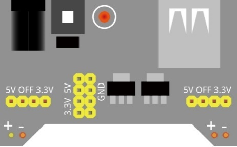
.. |Battery_cable| image:: ../_static/imgs/Battery_cable.png
.. |Speaker| image:: ../_static/imgs/Speaker.png
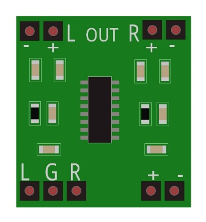
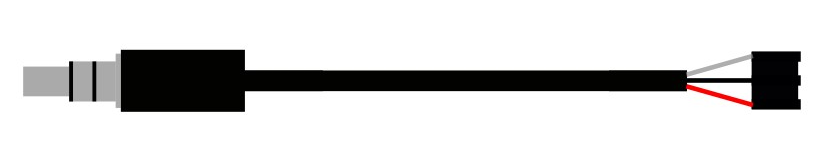

Component knowledge
================================================================

Speaker
----------------------------------------------------------------

Raspberry Pi can route sound via HDMI to the screen's built-in speakers or to the analog headphone jack. If your monitor has speakers, the sound is output via HDMI by default. If not, it is output via the headphone jack. This may not be the desired output setting, or the automatic detection is inaccurate, in which case you can switch the output manually. In following project, the analog headphone jack is used for output.

PAM8403 amplifier module
----------------------------------------------------------------

PAM8403 is a class D audio power amplifier IC with output power of 3 watts. It has the characteristics of low harmonic distortion and small noise crosstalk, so that it can reproduce the sound with better sound quality. It adopts a new structure without coupling output and without low-pass filter circuit, so that it can directly drive the speaker.

Its working voltage range is 2.5-5V. Two speakers (loads) should be connected before the PAM8403 module is powered up. Don't use voltages that exceed the power supply range to avoid damaging the Hall sensors. The audio input interface of PAM8403 amplifier module is shown in the figure below:

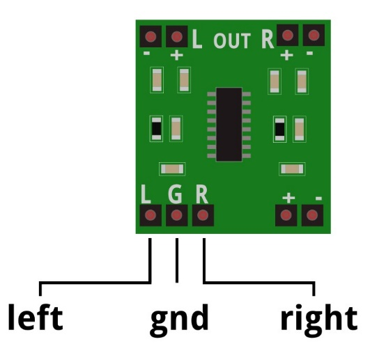

3.5mm 3 conductor audio cable to DuPont cable
----------------------------------------------------------------

3.5mm headphone plugs are divided into 3 conductor plugs and 4 conductor plugs. 3 conductor plug has three wires, namely: left channel, right channel and ground wire. 4 conductor plug has four wires, namely: left channel, right channel, ground wire and MIC microphone level. In the kit, a 3.5mm 3 conductor plug is used. As shown in the figure below, it is divided into left channel, right channel and ground wire from left to right.

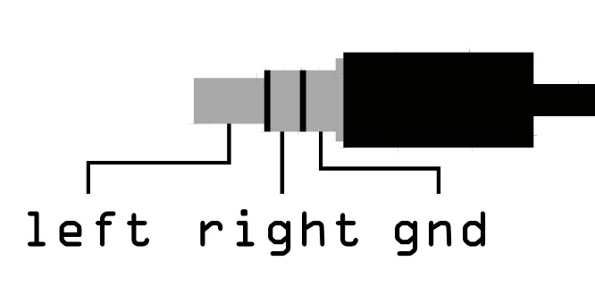

The audio cable to DuPont cable interface is shown in the figure below:

Circuit
================================================================

Be careful when connecting this circuit. Do not use the RPi to power the speaker amplifier module PAM8403 directly, as this may cause permanent damage to your RPi!

.. table:: 
    :align: center
    :width: 80%
    :class: table-line

    +------------------------------------------------------------------------------------+
    |   Hardware connection. If you need any support,please feel free to contact us via: |
    |                                                                                    |
    |   support@freenove.com                                                             |
    |                                                                                    |
    |   |PAM8403_Fr|                                                                     | 
    +------------------------------------------------------------------------------------+
    |   Next connect the peaker amplifier module PAM8403 cable.                          |
    |                                                                                    |
    |   The specific connection steps are as follows:                                    |
    |                                                                                    |
    |                                                                                    |
    |   :xx-large:`step 1`                                                               |
    |                                                                                    |
    |   |PAM8403_Step1|                                                                  | 
    |                                                                                    |
    |   :xx-large:`Step 2`                                                               |
    |                                                                                    |
    |   |PAM8403_Step2|                                                                  | 
    |                                                                                    |
    |   |PAM8403_Step2_1|                                                                | 
    |                                                                                    |
    |   :xx-large:`Step 3`                                                               |
    |                                                                                    |
    |   |PAM8403_Step3|                                                                  | 
    +------------------------------------------------------------------------------------+

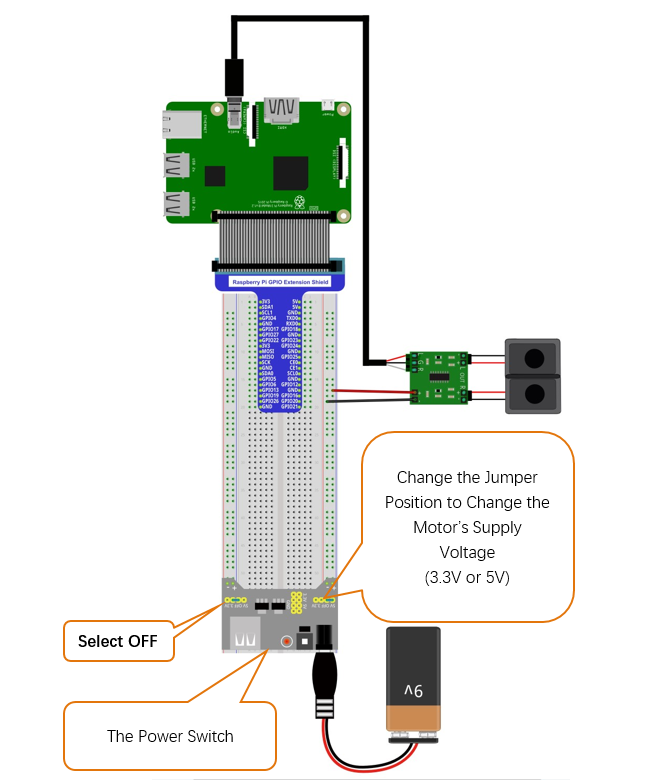
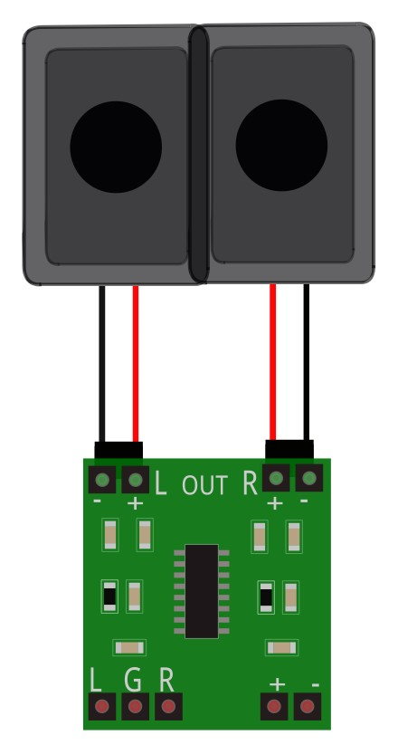
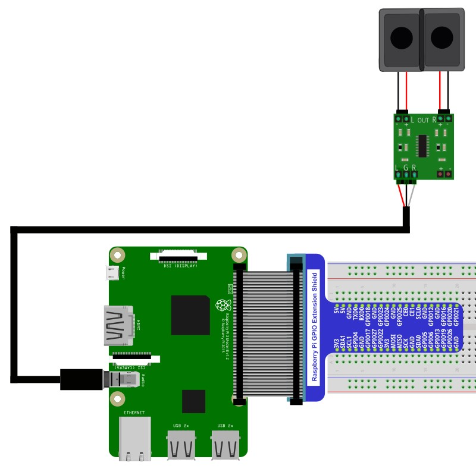
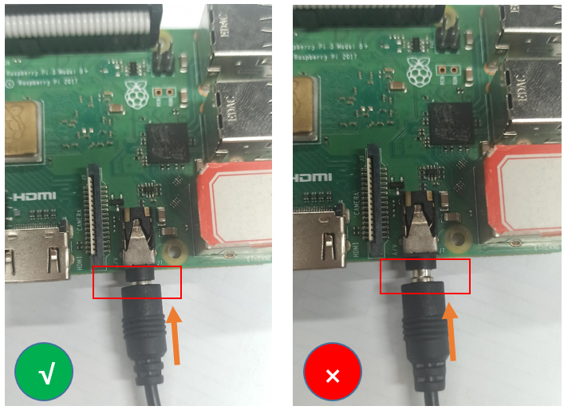
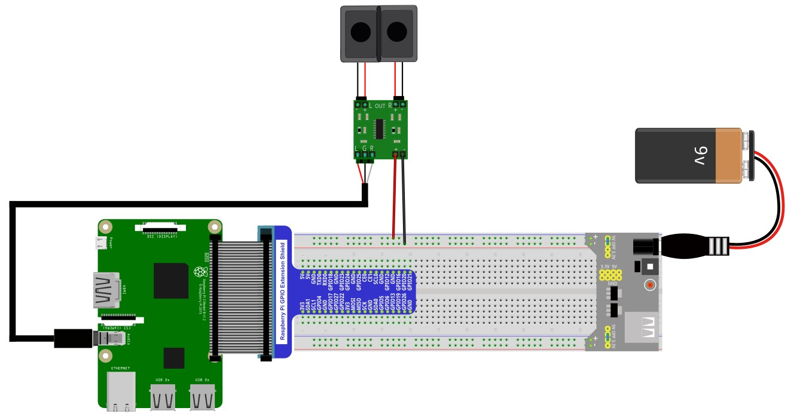

Additional supplement 
==================================

Raspbery Pi, other than 4B and 400, nees to restart the audio module. Otherwise the speaker amplifier module PAM8403 cannot be recognized.

1.  Create a new snd-blacklist.conf and open it for editing

.. code-block:: console

    $ sudo nano /etc/modprobe.d/snd-blacklist.conf

Find the contents of the following one lines (with Ctrl + W you can search):

.. code-block:: python

    blacklist snd_bcm2835

Add # to comment out the first line. Press Ctrl+O, Enter, Ctrl+X.

.. code-block:: python

    #blacklist snd_bcm2835

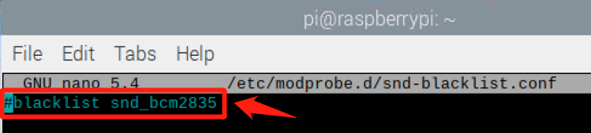

2.  We also need to edit config file.

.. code-block:: console

    $ sudo nano /boot/firmware/config.txt

Find the contents of the following two lines (with Ctrl + W you can search):

.. code-block:: python
    
    # Enable audio (loads snd_bcm2835)
    # dtparam=audio=on

Add # to comment out the second line. Press Ctrl+O, Enter, Ctrl+X.

.. code-block:: python
    
    # Enable audio (loads snd_bcm2835)
    dtparam=audio=on

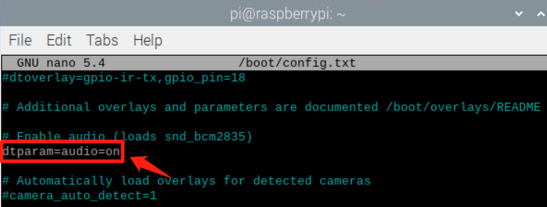

It will take effect after restarting, restart your RPi.

Configure audio output method and volume
================================================================

Configure audio output method
----------------------------------------------------------------

When your Pi doesn't have a desktop, you can right-click the speaker icon in the upper right corner to choose whether your Pi uses HDMI or Analog connection to handle sound. As shown below:

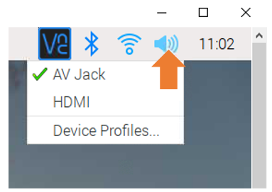

When your Pi doesn't have a desktop, you can choose how the sound is handled through the terminal command line.

Open the terminal and enter the following command.

.. code-block:: console

    $ sudo raspi-config

Then open the following dialog box: 

.. image:: ../_static/imgs/dialog_box.png
    :align: center

Choose "1 System Options" ->"S2 Audio" ->"3.5mm jack" ->"Yes" ->"Finish" in this order.

Configure volume
----------------------------------------------------------------

When your Pi has desktop, you left-click the speaker icon and move the slider up or down with the keyboard to adjust the volume. As shown below:

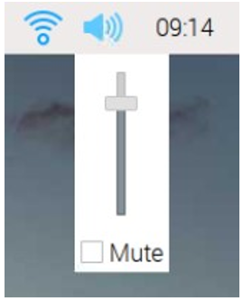

When your Pi doesn't have desktop, you can adjust the sound volume through the terminal command line.

Type command in the Terminal:

.. code-block:: console

    $ alsamixer

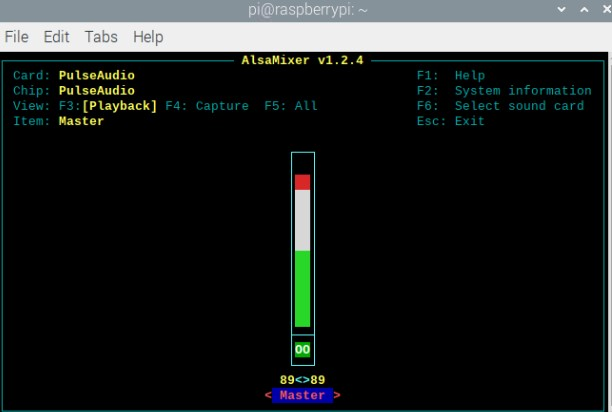

Determine if the sound card device is accessible and not muted (press the keyboard letter m to toggle). You can adjust the volume through the up and down arrows on the keyboard. After confirming that there is no problem, press Esc to exit. Finally, reboot your RPi. 

Ffplay tool
================================================================

ffplay
----------------------------------------------------------------

FFmpeg is a complete cross-platform audio and video solution, which can be used to handle audio and video transcoding, recording, streaming and other application scenarios. FFmpeg has three major tools, namely ffmpeg, ffprobe, and ffplay. Here we mainly introduce ffplay, which is a sub-tool of ffmpeg, which has powerful audio and video decoding and playback capabilities. This tool is already installed on your Raspberry Pi by default. You can use this tool from the command line. If you need to see more, please visit the official link: http://ffmpeg.org/.

You can see the common commands of ffmpeg with the following commands

.. code-block:: console

    $ ffplay --help

The following are some advanced commands of ffplay. As shown in the table below:

.. list-table::
   :header-rows: 1
   :align: center
   :class: zebra

   * - Command
     - Description

   * - -autoexit
     - Exit when video is done playing.

   * - -exitonkeydown
     - Exit if any key is pressed.

   * - -exitonmousedown
     - Exit if any mouse button is pressed.

   * - -acodec codec_name 
     - Force a specific audio decoder.

   * - -vcodec codec_name
     - Force a specific audio decoder.

   * - -scodec codec_name
     - Force a specific audio decoder.

   * - -autorotate
     - Automatically rotate the video according to file metadata. Enabled by default, use to disable it. -noautorotate

Code
================================================================

Python Code Music
----------------------------------------------------------------

Run program 

.. hint:: 
    :red:`If you have any concerns, please contact us via:`  support@freenove.com

1.  Use cd command to enter 35.1.1_Music directory of Python code.

.. code-block:: console

    $ cd ~/Freenove_Kit/Code/Python_GPIOZero_Code/35.1.1_Music

2.  Use command to execute

.. code-block:: console

    $ ffplay test.mp3

After executing the command, you can hear the test music playing. Here you can also play other music in this way. You can exit playback by pressing Esc on the keyboard.

Project TTS reminder
****************************************************************

This project uses the speaker amplifier module PAM8403 to make a TTS reminder.

Component List
================================================================

.. table:: 
    :align: center
    :width: 80%
    :class: table-line

    +------------------------------------------+-------------------------------+
    |1. Raspberry Pi (with 40 GPIO) x1         |                               |
    |                                          |   Jumper Wires                |
    |2. GPIO Extension Board & Ribbon Cable x1 |                               |
    |                                          |     |jumper-wire|             | 
    |3. Breadboard x1                          |                               |
    +------------------------------------------+-------------------------------+
    | Breadboard Power Module x1               | 9V Battery (you provide) & 9V |
    |                                          |                               |
    |                                          | Battery Cable                 |
    |                                          |                               |
    | |power-module|                           |  |Battery_cable|              |
    +-----------------------------+------------+--------------+----------------+
    | Speaker amplifier           | Speaker x2                | Audio cable x1 |
    |                             |                           |                |
    | module PAM8403 x1           |                           |                |
    |                             |                           |                |
    |  |PAM8403|                  |  |Speaker|                |  |Audio_cable| |
    +-----------------------------+---------------------------+----------------+
    | Infrared_sensor                                                          |
    |                                                                          |
    |  |Infrared_sensor|                                                       |
    +--------------------------------------------------------------------------+

.. |Infrared_sensor| image:: ../_static/imgs/Infrared_sensor.png
    :width: 15%
    
Component knowledge
================================================================

TTS
----------------------------------------------------------------

TTS, short for Text To Speech, is part of the human-machine dialogue that enables machines to speak. TTS can intelligently convert text into natural speech stream. TTS technology converts text files in real time, and the conversion time is fast. In theproject, TTS was used to broadcast the text "Hello, please stay away".

Circuit
================================================================

+-------------------------------------------------------------------------------------+
|   Schematic diagram                                                                 |
|                                                                                     |
|   |TTS_Sc|                                                                          |
+-------------------------------------------------------------------------------------+
|   Hardware connection. If you need any support,please feel free to contact us via:  |
|                                                                                     |
|   support@freenove.com                                                              | 
|                                                                                     |
|   |TTS_Fr|                                                                          |
|                                                                                     |
|   For the connection steps of the speaker amplifier module PAM8403, please refer to |
|                                                                                     |
|   :ref:`Project 35.1 play local music`                                              |
+-------------------------------------------------------------------------------------+

.. |TTS_Sc| image:: ../_static/imgs/TTS_Sc.png
    :width: 70%
.. |TTS_Fr| image:: ../_static/imgs/TTS_Fr.png

Code
================================================================

Python Code TTS
----------------------------------------------------------------

Install espeak before run python code.

1.  Enter the following command to install.

.. code-block:: console

    $ sudo apt-get install espeak

Enter 'y' to continu espeak library installation.

First observe the project result, and then learn about the code in detail.

.. hint:: 
    :red:`If you have any concerns, please contact us via:`  support@freenove.com

2.  Use cd command to enter 35.2.1_TTS directory of Python code.

.. code-block:: console

    $ cd ~/Freenove_Kit/Code/Python_GPIOZero_Code/35.2.1_TTS
    
3.  Use python command to execute code "TTS.py"

.. code-block:: console

    $ python TTS.py

After the program is executed, when you touch the infrared detection sensor, the speaker will broadcast "Hello, please stay away".

The following is the program code:

.. literalinclude:: ../../../freenove_Kit/Code/Python_GPIOZero_Code/35.2.1_TTS/TTS.py
    :linenos: 
    :language: python

Read the signal pin of the infrared obstacle avoidance sensor, and determine whether the sensor is touched by human beings. If the sensor is touched by human beings, the speaker will broadcast a reminder.

.. literalinclude:: ../../../freenove_Kit/Code/Python_GPIOZero_Code/35.2.1_TTS/TTS.py
    :linenos: 
    :language: python
    :lines: 15-20
    :dedent: