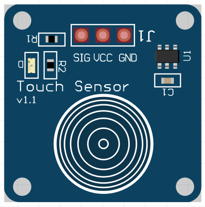
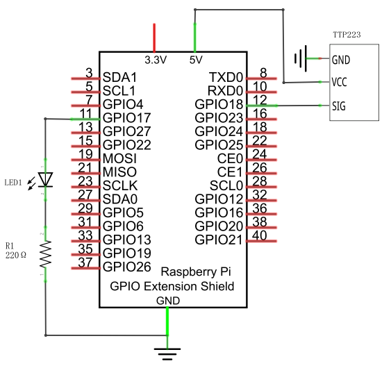
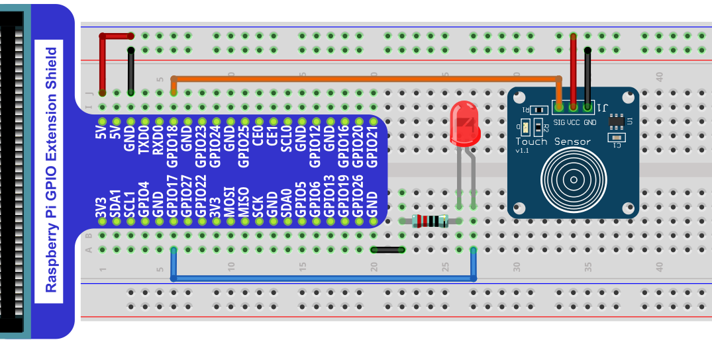
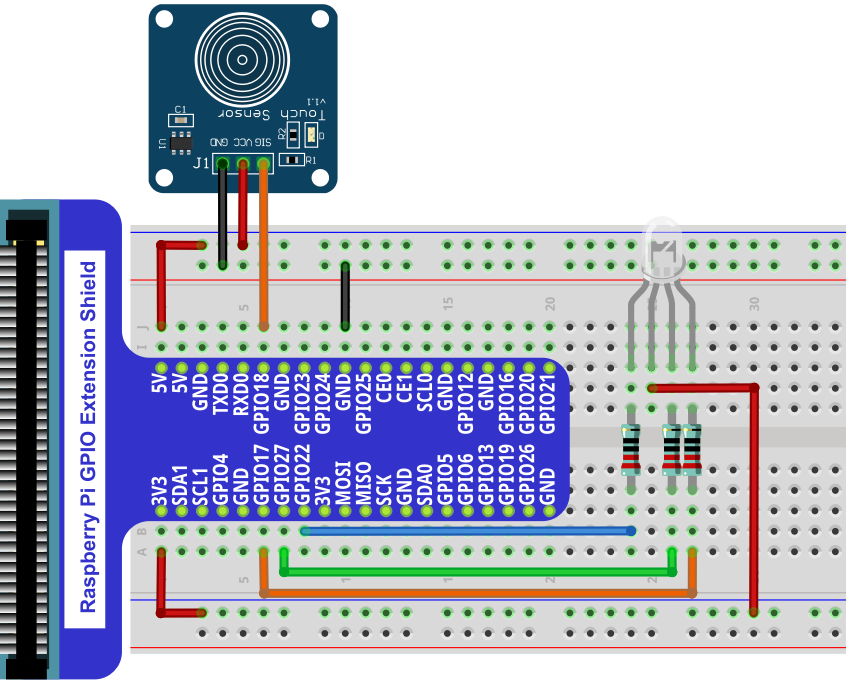

################################################################
Chapter Touch Sensor 
################################################################

In this chapter, we will learn how to use the touch sensor.

Project Touch Sensor and LED
****************************************************************

This project will use the touch sensor to control the LED to emit different brightness.

Component List
================================================================

.. table:: 
    :align: center
    :width: 80%

    +-------------------------------------------------+-----------------------------------+
    |1. Raspberry Pi (with 40 GPIO) x1                |                                   |     
    |                                                 | Jumper Wires x7                   |       
    |2. GPIO Extension Board & Ribbon Cable x1        |                                   |       
    |                                                 |  |jumper-wire|                    |                                                            
    |3. Breadboard x1                                 |                                   |                                                                 
    +---------------------------------------+---------+-----------------+-----------------+
    | TTP223 Touch Sensor x1                | LED x1                    | Resistor 220Ω x1|     
    |                                       |                           |                 |       
    |  |TTP223|                             | |red-led|                 | |res-220R1|     |       
    +---------------------------------------+---------------------------+-----------------+

.. |jumper-wire| image:: ../_static/imgs/jumper-wire.png

.. |res-220R1| image:: ../_static/imgs/res-220R.png
    :width: 10%
.. |red-led| image:: ../_static/imgs/red-led.png
    :width: 30%

Component knowledge
================================================================

Touch Sensor
----------------------------------------------------------------

The touch sensor module is a capacitive touch switch module based on TTP223 chip. Its use is very simple. This module has 3 pins: signal pin, power positive pin and power negative pin. When the positive and negative pins of the module are connected to a suitable power supply, the module starts to work. At this time, only one pin on the development board is needed to read the output signal of the module. For example, you can touch the front and back of the module. When the touch sensor is touched, the signal pin outputs a high level; when the touch sensor is not touched, it outputs a low level.

Below is the pinout of the touch sensor.

**Pin description:**

.. list-table::
   :align: center
   :header-rows: 1
   :class: product-table

   * - symbol
     - Function

   * - SIG
     - Output control signal 

   * - VCC
     - Power supply pin, +2.0V~5.5V

   * - GND
     - GND

Please do not use voltage beyond the power supply range to avoid damage to the touch sensor.

Circuit
================================================================

+-------------------------------------------------------------------------------------+
|   Schematic diagram                                                                 |
|                                                                                     |
|   |TTP223_Sc|                                                                       |
+-------------------------------------------------------------------------------------+
|   Hardware connection. If you need any support,please feel free to contact us via:  |
|                                                                                     |
|   support@freenove.com                                                              | 
|                                                                                     |
|   |TTP223_Fr|                                                                       |
+-------------------------------------------------------------------------------------+

Code
================================================================

Python Code TouchSensor
----------------------------------------------------------------

.. hint:: 
    
    :red:`If you have any concerns, please contact us via:`  support@freenove.com

1.  Use cd command to enter 27.1.1_TouchSensor directory of Python code. 

.. code-block:: console

    $ cd ~/Freenove_Kit/Code/Python_GPIOZero_Code/27.1.1_TouchSensor

2.  Use Python command to execute code " TouchSensor.py".

.. code-block:: console

    $ python TouchSensor.py

In this code, we use the touch sensor to adjust the brightness of the LED. Every time you touch the sensor with your hand, the brightness of the LED changes.

The following is the program code:

.. literalinclude:: ../../../freenove_Kit/Code/Python_GPIOZero_Code/27.1.1_TouchSensor/TouchSensor.py
    :linenos: 
    :language: python
    :dedent:

Import the TouchSensor class from the sensor module. TouchSensor is similar to the MotionSensor class in the GPIO Zero library in that they both actually use the SmoothedInputDevice class.

.. code-block:: python
    :linenos:

    from sensor import TouchSensor

sensor.when_touch associates the touch sensor pin with SensorEven(). When SensorPin detects a high level, the SensorEven() function is called and executed. That is, every time the sensor is touched, a variable called grade is used to record the number of touches.

.. literalinclude:: ../../../freenove_Kit/Code/Python_GPIOZero_Code/27.1.1_TouchSensor/TouchSensor.py
    :linenos: 
    :language: python
    :lines: 18-27
    :dedent:

Set the LED light to emit different brightness according to the value of grade.

.. literalinclude:: ../../../freenove_Kit/Code/Python_GPIOZero_Code/27.1.1_TouchSensor/TouchSensor.py
    :linenos: 
    :language: python
    :lines: 30-41
    :dedent:

**sensor.py**

Import the SmoothedInputDevice class from the GPIO Zero library, create the TouchSensor class, and initialize the parametersImport the SmoothedInputDevice class from the GPIO Zero library, create the TouchSensor class, and initialize the parameters

.. literalinclude:: ../../../freenove_Kit/Code/Python_GPIOZero_Code/27.1.1_TouchSensor/sensor.py
    :linenos: 
    :language: python
    :dedent:

.. seealso::

    For more information about the methods used by the SmoothedInputDevice class in the GPIO Zero library,please refer to: https://gpiozero.readthedocs.io/en/stable/api_input.html#smoothedinputdevice

Project Touch Sensor and RGB LED
****************************************************************

This project uses a touch sensor to control RGB LED to emit different colors.

Component List
================================================================

.. table:: 
    :align: center
    :width: 80%

    +-------------------------------------------------+---------------------------------------+
    |1. Raspberry Pi (with 40 GPIO) x1                |                                       |     
    |                                                 | Jumper Wires x10                      |       
    |2. GPIO Extension Board & Ribbon Cable x1        |                                       |       
    |                                                 |  |jumper-wire|                        |                                                            
    |3. Breadboard x1                                 |                                       |                                                                 
    +---------------------------------------+---------+-------------------+-------------------+
    | TTP223 Touch Sensor x1                | RGB LED x1                  | Resistor 220Ω x3  |     
    |                                       |                             |                   |       
    |  |TTP223|                             | |RGB-LED-real|              | |res-220R|        |       
    +---------------------------------------+-----------------------------+-------------------+

.. |res-220R| image:: ../_static/imgs/res-220R.png
    :width: 10%
.. |RGB-LED-real| image:: ../_static/imgs/red-led.png
    :width: 30%

Circuit
================================================================

+-------------------------------------------------------------------------------------+
|   Schematic diagram                                                                 |
|                                                                                     |
|   |TTP223_Sc_1|                                                                     |
+-------------------------------------------------------------------------------------+
|   Hardware connection. If you need any support,please feel free to contact us via:  |
|                                                                                     |
|   support@freenove.com                                                              | 
|                                                                                     |
|   |TTP223_Fr_1|                                                                     |
+-------------------------------------------------------------------------------------+

Code
================================================================

Python Code Discolor
----------------------------------------------------------------

First, observe the project result, and then learn about the code in detail.

.. hint:: 
    
    :red:`If you have any concerns, please contact us via:`  support@freenove.com

1.  Use cd command to enter 27.2.1_Discolor directory of Python code.

.. code-block:: console

    $ cd ~/Freenove_Kit/Code/Python_GPIOZero_Code/27.2.1_Discolor

2.  Use Python command to execute code " Discolor.py ".

.. code-block:: console

    $ python Discolor.py

After the program is executed, we can use the touch sensor to adjust the color change of the RGB LED. Every time the sensor is touched, the color of the RGB LED changes. Color changes from red to green to blue.

The following is the program code:

.. literalinclude:: ../../../freenove_Kit/Code/Python_GPIOZero_Code/27.2.1_Discolor/Discolor.py
    :linenos: 
    :language: python
    :dedent:

GPIO.add_event_detect() associates the touch sensor pin with SensorEven(). When SensorPin detects a high level, the SensorEven() function is called and executed.

.. literalinclude:: ../../../freenove_Kit/Code/Python_GPIOZero_Code/27.2.1_Discolor/Discolor.py
    :linenos: 
    :language: python
    :lines: 18-23
    :dedent:

Determine the number of times the sensor is pressed, and control the pin R, G, and B to output different PWM values, thereby controlling the color of the RGB LED.

.. literalinclude:: ../../../freenove_Kit/Code/Python_GPIOZero_Code/27.2.1_Discolor/Discolor.py
    :linenos: 
    :language: python
    :lines: 29-40
    :dedent: