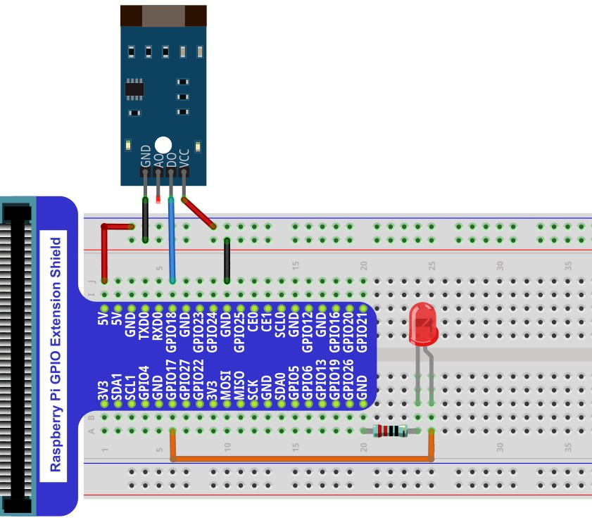
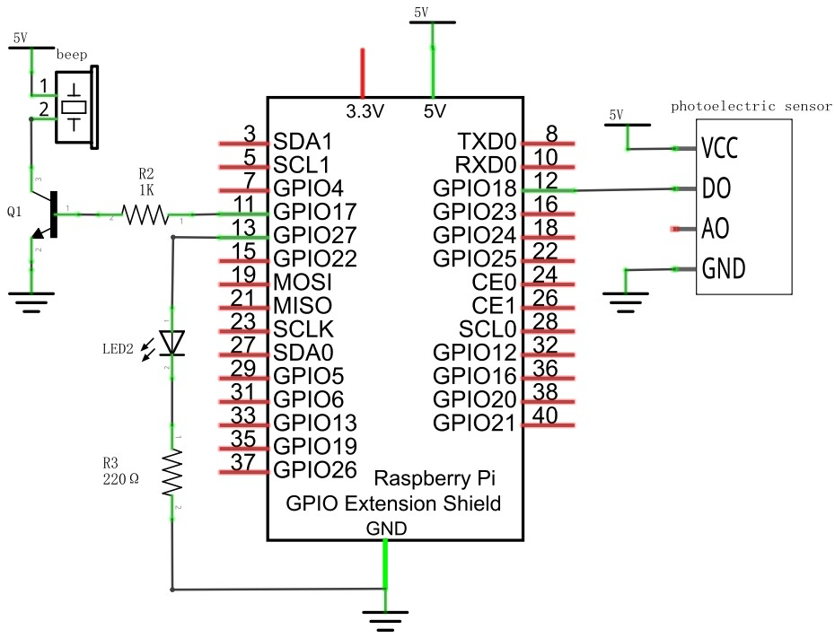
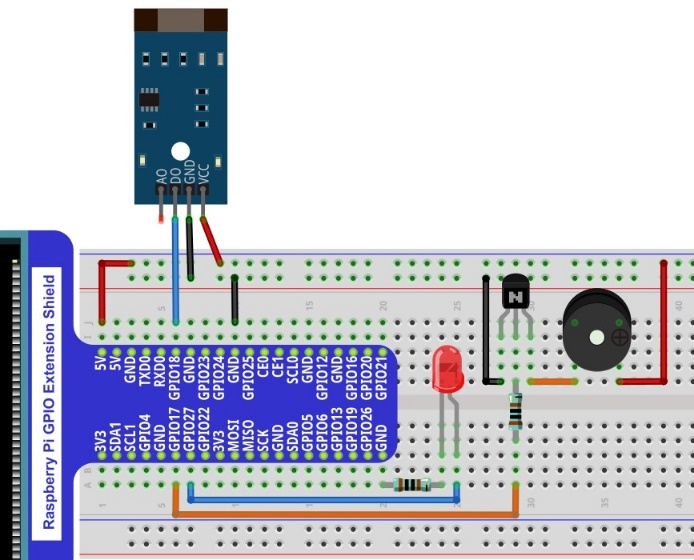

################################################################
Chapter U-shaped photoelectric sensor
################################################################

In this chapter, we will learn how to use a U-shaped photoelectric sensor.

Project U-shaped photoelectric sensor and LED
****************************************************************

This project uses a U-shaped photoelectric sensor to control the state of the LED.	

Component List
================================================================

.. table:: 
    :align: center
    :width: 80%
    :class: table-line

    +-------------------------------------------------+------------------------------------+
    |1. Raspberry Pi (with 40 GPIO) x1                |                                    |     
    |                                                 | Jumper Wires x6                    |       
    |2. GPIO Extension Board & Ribbon Cable x1        |                                    |       
    |                                                 |  |jumper-wire|                     |                                                            
    |3. Breadboard x1                                 |                                    |                                                                 
    +-------------------------------------------------+-----------------+------------------+
    | TTP223 Touch Sensor x1                          | LED x1          | Resistor 220Ω x1 |   
    |                                                 |                 |                  |       
    | |photoelectric| :xx-large:`or` |photoelectric_1||  |red-led1|     | |res-220R1|      |       
    +-------------------------------------------------+-----------------+------------------+

.. |jumper-wire| image:: ../_static/imgs/jumper-wire.png
.. |photoelectric| image:: ../_static/imgs/photoelectric.png
    :width: 35%
.. |photoelectric_1| image:: ../_static/imgs/photoelectric_1.png
    :width: 30%
.. |res-220R1| image:: ../_static/imgs/res-220R.png
    :width: 15%
.. |red-led1| image:: ../_static/imgs/red-led.png
    :width: 30%

Component knowledge
================================================================

U-shaped photoelectric sensor
----------------------------------------------------------------

The U-shaped photoelectric sensor is a through-beam photoelectric sensor, which consists of a transmitting end and a receiving end. Its working principle is blocking and conducting the infrared emission light will change the current induced by the infrared receiving tube. 

This module has 4 pins: digital output (DO), analog output (AO), power supply positive pin and power supply negative pin. When the positive and negative pins of the module are connected to a suitable power supply, the module starts to work. Only one pin on the development board is needed to read the digital output (DO) signal of the module. When the photoelectric sensor is blocked, the digital signal pin outputs a low level. If the photoelectric sensor is not blocked, it outputs a high level.
Below is the pinout of the touch sensor.

Below is the pinout of the touch sensor.

**Pin description:**

.. list-table::
   :align: center
   :header-rows: 1
   :class: zebra

   * - symbol
     - Function

   * - VCC
     - Power supply pin, +3.3V~5.5V  

   * - DO
     - Output control signal(High or low level)

   * - AO
     - Output invalid

   * - GND
     - GND

:red:`Please do not use the voltage beyond the power supply range to avoid damage to the U-shaped photoelectric sensor.`

:red:`The difference between the above two U-type photoelectric sensors is that in addition to the different pin sequence, the output signal is opposite when you block it, that is, there are modules that output high level and low level U-type photoelectric sensor. The specific module is subject to the one in your hand. Please check the pin sequence of your U-shaped photoelectric sensor and replace the appropriate wiring to avoid permanent damage to your raspberry PI.`

Circuit
================================================================

.. table::
    :align: center
    :width: 80%
    :class: table-line

    +------------------------------------------------------------------------------------+
    |   Schematic diagram                                                                |
    |                                                                                    |
    |   |photoelectric_Sc|                                                               |
    +------------------------------------------------------------------------------------+
    |   Hardware connection. If you need any support,please feel free to contact us via: |
    |                                                                                    |
    |   support@freenove.com                                                             | 
    |                                                                                    |
    |   |photoelectric_Fr|                                                               |
    +------------------------------------------------------------------------------------+

.. |photoelectric_Sc| image:: ../_static/imgs/photoelectric_Sc.png

.. note::
    
    :red:`Please check the sequence of your U-shaped photoelectric sensor and select the appropriate wiring to avoid permanent damage to your raspberry PI.`

Code
================================================================

Python Code PhotoSensor
----------------------------------------------------------------

First observe the project result, and then learn about the code in detail.

.. hint:: 
    
    :red:`If you have any concerns, please contact us via:`  support@freenove.com

1.  Use ``cd`` command to enter 28.1.1 1_Photosensor directory of Python code.

.. code-block:: console

    $ cd ~/Freenove_Kit/Code/Python_GPIOZero_Code/28.1.1_PhotoSensor

2.  Use python command to execute code ``PhotoSensor.py``

.. code-block:: console

    $ python  PhotoSensor.py

When you use the module whose output signal is low level, after the program is executed, when the photoelectric sensor is blocked, the LED lights up, when the photoelectric sensor is not blocked, the LED turns off.

When you use the module with high output signal, the LED will be off when the photoelectric sensor is blocked and on when the photoelectric sensor is not blocked after the program is executed.

The phenomena are opposite, depending on the module in your hand.

The following is the program code:

.. literalinclude:: ../../../freenove_Kit/Code/Python_GPIOZero_Code/28.1.1_PhotoSensor/PhotoSensor.py
    :linenos: 
    :language: python
    :dedent:

Import the PhotoSensor class from the sensor module. PhotoSensor is similar to the MotionSensor class in the GPIO Zero library in that they both actually use the SmoothedInputDevice class.

.. code-block:: python

    from sensor import PhotoSensor

.. seealso::

    For more information about the methods used by the SmoothedInputDevice class in the GPIO Zero library,please refer to: https://gpiozero.readthedocs.io/en/stable/api_input.html#smoothedinputdevice

Project U-shaped photoelectric sensor and buzzer
****************************************************************

This project uses U-shaped photoelectric sensor to make a simple sound and light alarm. 

Component List
================================================================

.. table::
    :align: center
    :width: 80%
    :class: table-line

    +------------------------------------------------------------+-------------------------------------------------+
    |1. Raspberry Pi (with 40 GPIO) x1                           |                                                 |     
    |                                                            | Jumper Wires x10                                |       
    |2. GPIO Extension Board & Ribbon Cable x1                   |                                                 |       
    |                                                            |  |jumper-wire|                                  |                                                            
    |3. Breadboard x1                                            |                                                 |                                                                 
    +--------------------------------------------------+---------+------------------------+------------------------+
    | Active buzzer x1                                 | NPN transistorx1 (S8050)         | Resistor 1kΩx1         |     
    |                                                  |                                  |                        |       
    |  |Active-buzzer|                                 | |NPN-transistor|                 | |Resistor-1kΩ|         |       
    +--------------------------------------------------+----------------------------------+------------------------+
    | U-shaped photoelectric sensor x1                 | LED x1                           | Resistor 220Ω x1       |     
    |                                                  |                                  |                        |       
    | |photoelectric| :xx-large:`or` |photoelectric_1| | |red-led|                        | |res-220R|             |       
    +--------------------------------------------------+----------------------------------+------------------------+

.. |Active-buzzer| image:: ../_static/imgs/Active-buzzer.png
    :width: 40%
.. |res-220R| image:: ../_static/imgs/res-220R.png
    :width: 20%
.. |NPN-transistor| image:: ../_static/imgs/NPN-transistor.png
    :width: 45%
.. |Resistor-1kΩ| image:: ../_static/imgs/Resistor-1kΩ.png
    :width: 20%
.. |red-led| image:: ../_static/imgs/red-led.png
    :width: 30%

Circuit
================================================================

.. table::
    :align: center
    :width: 80%
    :class: table-line

    +------------------------------------------------------------------------------------------------+
    |   Schematic diagram                                                                            |
    |                                                                                                |
    |   |photoelectric_Sc_1|                                                                         |
    +------------------------------------------------------------------------------------------------+
    |   Hardware connection. If you need any support,please feel free to contact us via:             |
    |                                                                                                |
    |   support@freenove.com                                                                         | 
    |                                                                                                |
    |   |photoelectric_Fr_2|    :xx-large:`or`  |photoelectric_Fr_3|                                 |
    +------------------------------------------------------------------------------------------------+

.. |photoelectric_Fr_2| image:: ../_static/imgs/photoelectric_Fr_2.png
    :width: 49%

.. note::
    
    :red:`Please check the sequence of your U-shaped photoelectric sensor and select the appropriate wiring to avoid permanent damage to your raspberry PI.`

Code
================================================================

Python Code Alertor
----------------------------------------------------------------

First observe the project result, and then learn about the code in detail.

.. hint:: 
    
    :red:`If you have any concerns, please contact us via:`  support@freenove.com

1.  Use ``cd`` command to enter 28.2.1_Alertor directory of Python code

.. code-block:: console

    $ cd ~/Freenove_Kit/Code/Python_GPIOZero_Code/28.2.1_Alertor

2.  Use python command to execute code ``Alertor.py``

.. code-block:: console

    $ python Alertor.py

After the program is executed, every time the U-shaped photoelectric sensor is blocked by hand, the buzzer will sound an alarm, and the LED will flash to remind.

The following is the program code:

.. literalinclude:: ../../../freenove_Kit/Code/Python_GPIOZero_Code/28.2.1_Alertor/Alertor.py
    :linenos: 
    :language: python
    :dedent:

The sensor.when_occlusion and sensor.when_no_occlusion functions associate the sensor pin with sensorEven().Because there are high level triggering module and low level triggering module in the U-type photoelectric sensor, we use the double-edge detection method here to make the program compatible with the module in your hand. When sensorPin detects low level or high level, it will call and execute the sensorEven() function.

.. literalinclude:: ../../../freenove_Kit/Code/Python_GPIOZero_Code/28.2.1_Alertor/Alertor.py
    :linenos: 
    :language: python
    :lines: 30-36
    :dedent:

The function alarm() is used to control the active buzzer to emit an alarm sound and control the LED to flash at the same time. Use variable times to pass in the number of times the alarm sounds and the LED blinks.

.. literalinclude:: ../../../freenove_Kit/Code/Python_GPIOZero_Code/28.2.1_Alertor/Alertor.py
    :linenos: 
    :language: python
    :lines: 19-28
    :dedent: