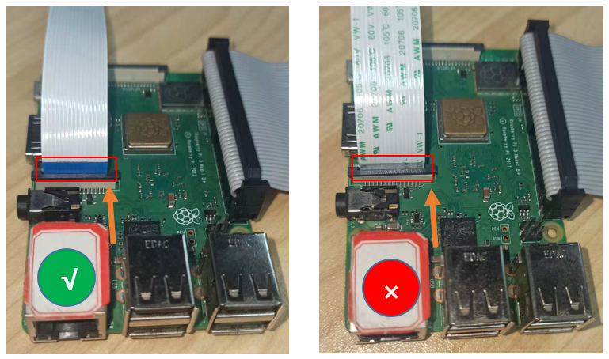
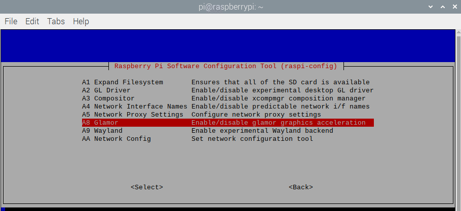
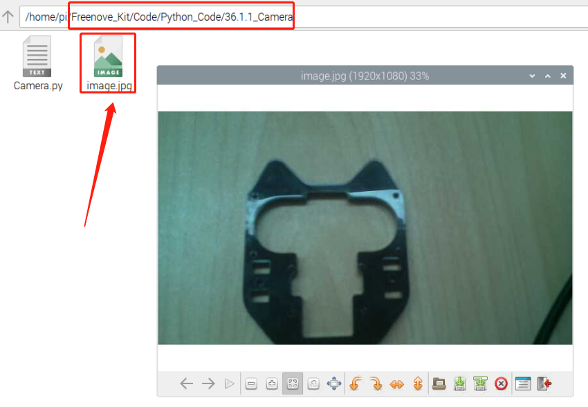

################################################################
Chapter camera
################################################################

In this chapter, we will learn how to use camera.

Project TTS reminder
****************************************************************

This project uses a camera to take a picture and save it in the corresponding location.

Component List

+-------------------------------------------------+-------------------------------------------------+
| Breadboard Power Module x1                      | Jumper x3                                       |
|                                                 |                                                 |
| |power-module|                                  |  |jumper-wire|                                  |
+-----------------------------+-------------------+--------------+----------------------------------+
| Camera x1                   | Resistor 10kΩ x2                 | Push Button Switch x1            |
|                             |                                  |                                  |
|  |camera|                   |  |Resistor-10kΩ|                 |  |button-small|                  |
+-----------------------------+----------------------------------+----------------------------------+

.. |jumper-wire| image:: ../_static/imgs/jumper-wire.png
.. |camera| image:: ../_static/imgs/Battery_cable.png
.. |Resistor-10kΩ| image:: ../_static/imgs/Resistor-10kΩ.png
    :width: 20%
.. |button-small| image:: ../_static/imgs/button-small.jpg

Component knowledge
================================================================

Camera
----------------------------------------------------------------

The camera is connected to the Raspberry Pi through a 15-pin cable. There are only two sockets to connect.

Next connect the camera to the Raspberry Pi. First turn off the power switch of the Raspberry Pi and disconnect the power cord. Then connect the CSI camera with Raspberry Pi camera port. :red:`(The CSI camera must be connected or disconnected without power and the Raspberry Pi is turned off, otherwise it may burn the camera.)` It needs to be connected correctly, otherwise the camera will not work.

Circuit
================================================================

+------------------------------------------------------------------------------------------------+
|   Schematic diagram                                                                            |
|                                                                                                |
|   |camera_Sc|                                                                                  |
+------------------------------------------------------------------------------------------------+
|   Hardware connection. If you need any support,please feel free to contact us via:             |
|                                                                                                |
|   support@freenove.com                                                                         |
|                                                                                                |
|   |camera_Fr|                                                                                  |
|                                                                                                |
|   :red:`Next connect the camera cable.`                                                        |
|                                                                                                |
|   After connected, it should be as follows                                                     |
|                                                                                                |
|   Step 1                                                                                       |
|                                                                                                |
|     |camera_step1|                                                                             |
|                                                                                                |
|   Step 2                                                                                       |
|                                                                                                |
|     |camera_step2|                                                                             |
|                                                                                                |
|   The :blue:`Blue side` of cable should be toward to Servo.                                    |
|                                                                                                |
|   Connect one end of cable to camera. Please note the front and back of the cable.             |
|                                                                                                |
|   Step 3                                                                                       |
|                                                                                                |
|     |camera_step3|                                                                             |
|                                                                                                |
|   Step 4                                                                                       |
|                                                                                                |
|     |camera_step4|                                                                             |
|                                                                                                |
|   The :blue:`Blue side` of cable should be toward to Servo.                                    |
|                                                                                                |
|   Connect one end of cable to camera. Please note the front and back of the cable.             |
+------------------------------------------------------------------------------------------------+

.. |camera_Sc| image:: ../_static/imgs/camera_Sc.png

.. |camera_step1| image:: ../_static/imgs/camera_step1.png
.. |camera_step2| image:: ../_static/imgs/camera_step2.png
.. |camera_step3| image:: ../_static/imgs/camera_step3.png

:red:`The CSI camera must be connected or disconnected under no power and when Raspberry Pi is shut down, or the camera may be burned.`

libcamera-apps does not work properly on Pi 0 to 3 devices when running the latest Bullseye images.

A workaround is to open a terminal, run "sudo raspi-config", navigate to "Advanced Options" and enable "Glamor" graphic acceleration. Then reboot your Pi.

.. code-block:: console

    $ sudo raspi-config

.. image:: ../_static/imgs/reboot.png
    :align: center

.. image:: ../_static/imgs/reboot_2.png
    :align: center

Code
================================================================

Detect camera:

.. code-block:: console

    $ v4l2-ctl --list-devices

.. image:: ../_static/imgs/list_device.png
    :align: center

If you do not get the result above, please check whether the camera wire is connected correctly.

.. note::

    :red:`When plugging in or pulling out camera wire, please make sure Raspberry Pi is turned OFF. Otherwise, it may burn out the camera.`

Python Code 36.1.1 Camera
----------------------------------------------------------------

First observe the project result, and then learn about the code in detail.

.. hint:: 
    :red:`If you have any concerns, please contact us via:`  support@freenove.com

1.  Use ``cd`` command to enter 36.1.1_Camera directory of Python code.

.. code-block:: console

    $ cd ~/Freenove_Kit/Code/Python_GPIOZero_Code/36.1.1_Camera

2.  Use python command to execute code ``Camera.py``

.. code-block:: console

    $ python Camera.py

After the program is executed, you can take a photo by pressing the button. When the button is pressed, you will see image.jpg in the corresponding directory. As shown below:

.. literalinclude:: ../../../freenove_Kit/Code/Python_GPIOZero_Code/36.1.1_Camera/Camera.py
    :linenos: 
    :language: python

Read the signal pin of the button, and determine whether the button is pressed, if the button is pressed, take a photo and save it in the corresponding directory.

.. literalinclude:: ../../../freenove_Kit/Code/Python_GPIOZero_Code/36.1.1_Camera/Camera.py
    :linenos: 
    :language: python
    :lines: 17-27

Project Video Recording
****************************************************************

This project uses a camera to shoot a video and play it back.

Component List
================================================================

+-------------------------------------------------+-------------------------------------------------+
| Breadboard Power Module x1                      | Jumper x8                                       |
|                                                 |                                                 |
| |power-module|                                  |  |jumper-wire|                                  |
+-----------------------------+-------------------+--------------+----------------------------------+
| Camera x1                   | Resistor 10kΩ x4                 | Push Button Switch x2            |
|                             |                                  |                                  |
|  |camera|                   |  |Resistor-10kΩ|                 |  |button-small|                  |
+-----------------------------+----------------------------------+----------------------------------+

.. |jumper-wire| image:: ../_static/imgs/jumper-wire.png
.. |camera| image:: ../_static/imgs/Battery_cable.png
.. |Resistor-10kΩ| image:: ../_static/imgs/Resistor-10kΩ.png
    :width: 20%
.. |button-small| image:: ../_static/imgs/button-small.jpg

Circuit
================================================================

+------------------------------------------------------------------------------------------------+
|   Schematic diagram                                                                            |
|                                                                                                |
|   |camera_Sc_1|                                                                                |
+------------------------------------------------------------------------------------------------+
|   Hardware connection. If you need any support,please feel free to contact us via:             |
|                                                                                                |
|   support@freenove.com                                                                         | 
|                                                                                                |
|   |camera_Fr_1|                                                                                |
+------------------------------------------------------------------------------------------------+

.. |camera_Fr_1| image:: ../_static/imgs/camera_Fr_1.png

Code
================================================================

Detect camera:

.. code-block:: console

    $ v4l2-ctl --list-devices

.. image:: ../_static/imgs/list_device.png
    :align: center

If you do not get the result above, please check whether the camera wire is connected correctly.

.. note::

    :red:`When plugging in or pulling out camera wire, please make sure Raspberry Pi is turned OFF. Otherwise, it may burn out the camera.`

Python Code 36.2.1 Video
----------------------------------------------------------------

First observe the project result, and then learn about the code in detail.

.. hint:: 
    :red:`If you have any concerns, please contact us via:`  support@freenove.com

1.  Use cd command to enter 36.2.1_Camera directory of Python code.

.. code-block:: console

    $ cd ~/Freenove_Kit/Code/Python_GPIOZero_Code/36.2.1_Video
    
2.  Use python command to execute code "Video.py"

.. code-block:: console

    $ python Video.py

After the program is executed, you can shoot a video by pressing the button. When the shooting button is pressed, you will see Video.h264 in the corresponding directory. When the play button is pressed, the corresponding captured video will be played, as shown in the image below. You can repeat the above operation to capture other videos, but it will overwrited the previous video.

.. image:: ../_static/imgs/py_camera_1.png
    :align: center

The following is the program code:

.. literalinclude:: ../../../freenove_Kit/Code/Python_GPIOZero_Code/36.2.1_Video/Video.py
    :linenos: 
    :language: python

Read the signal pin of the shooting button, and determine whether the button is pressed, if the button is pressed, shoot a video and save it in the corresponding directory.

.. literalinclude:: ../../../freenove_Kit/Code/Python_GPIOZero_Code/36.2.1_Video/Video.py
    :linenos: 
    :language: python
    :lines: 21-31

Read the signal pin of the play button, and determine whether the button is pressed. If the button is pressed, use the ffplay tool to play the corresponding video. When the video finishes playing, the playback interface will be closed automatically.

.. literalinclude:: ../../../freenove_Kit/Code/Python_GPIOZero_Code/36.2.1_Video/Video.py
    :linenos: 
    :language: python
    :lines: 33-36

